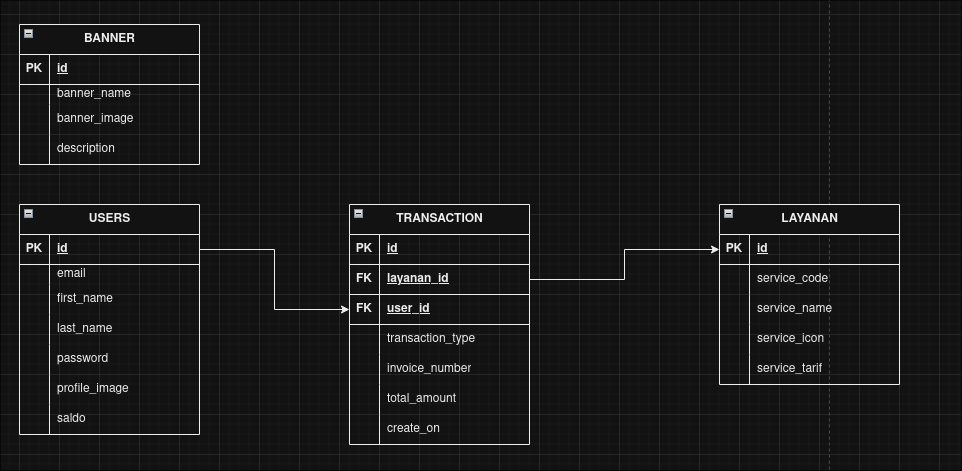

# Project Javascript Using Clean Architecture

Javascript, ExpressJs, postgresql, raw-query, github

## Pattern Dependency Ijection(DI)

Config(Pool) > Repository > Service > Controller > router > app(server)

### ERD

